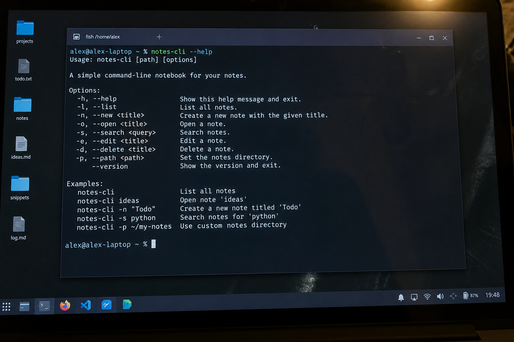

# notes-cli

Tiny CLI that prints or creates a notes file. Learning-in-public.


## Screenshot



## Install

```bash
python3 -m pip install -e .
notes-cli --help
```

## Usage

```bash
notes-cli notes.txt
```

Small side project by Sandra Roth. Notes and a CLI, nothing fancy.

## License

MIT
